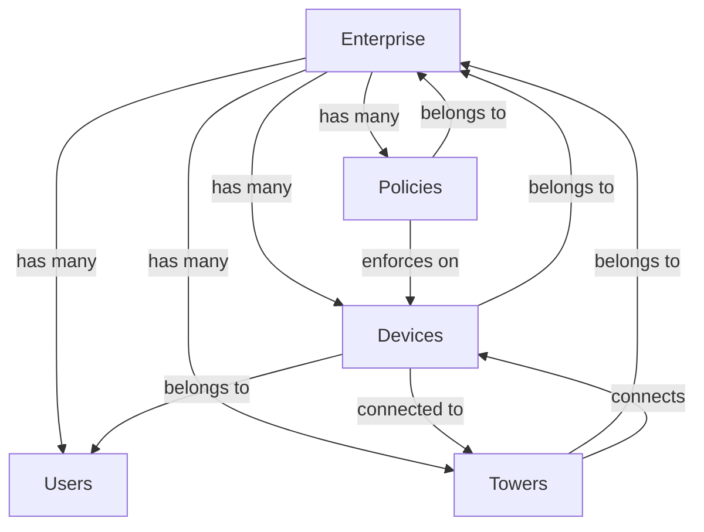

# Entity Models and Relationships

## Core Entities

### Enterprise

```typescript
interface Enterprise {
  id: string;
  name: string;
  tier: "standard" | "premium";
  contactEmail: string;
  contactPhone: string;
  address: {
    street: string;
    city: string;
    state: string;
    country: string;
    zipCode: string;
  };
  subscription: {
    status: "active" | "suspended" | "cancelled";
    tier: "basic" | "standard" | "premium" | "enterprise";
    features: {
      autoRemediation: boolean;
      realTimeMonitoring: boolean;
      customPolicies: boolean;
    };
  };
  users: User[];
  devices: Device[];
  policies: Policy[];
  towers: Tower[];
}
```

### User

```typescript
interface User {
  id: string;
  email: string;
  role: "admin" | "manager" | "employee" | "contractor" | "guest";
  department: string;
  devices: string[]; // Device IDs
  lastLogin: string;
  status: "active" | "inactive" | "suspended";
}
```

### Device

```typescript
interface Device {
  id: string;
  name: string;
  type: "smartphone" | "tablet" | "laptop" | "IoT" | "gateway";
  os: "iOS" | "Android" | "Windows" | "Other";
  carrier: "AT&T" | "Verizon" | "T-Mobile" | "Sprint" | "US Cellular";
  status: "active" | "inactive" | "quarantined" | "discovered";
  enterpriseId: string;
  userId: string;
  towerId?: string;
  location: {
    latitude: number;
    longitude: number;
    address: string;
  };
  securityStatus: {
    isCompliant: boolean;
    vulnerabilities: number;
    securityScore: number;
  };
}
```

### Policy

```typescript
interface Policy {
  id: string;
  enterpriseId: string;
  name: string;
  description: string;
  priority: "low" | "medium" | "high" | "critical";
  status: "active" | "inactive";
  rules: {
    appId: string;
    actions: {
      actionId: string;
      allowedRoles: string[];
      conditions?: {
        deviceTypes?: string[];
        operatingSystems?: string[];
        carriers?: string[];
      };
    }[];
  }[];
  enforcement: {
    action: "allow" | "deny" | "notify" | "quarantine";
    notifyUsers: string[];
    autoRemediation: boolean;
  };
}
```

### Tower

```typescript
interface Tower {
  id: string;
  name: string;
  status: "active" | "maintenance" | "inactive";
  location: {
    latitude: number;
    longitude: number;
    address: string;
  };
  carriers: {
    carrier: string;
    supportedOS: string[];
    supportedDevices: string[];
    coverage: {
      radius: number;
      signalStrength: number;
    };
  }[];
  realEstateProvider: string;
  connectedDevices: string[]; // Device IDs
}
```

## Entity Relationships



## Key Enums

```typescript
// Device Types
type DeviceType = "smartphone" | "tablet" | "laptop" | "IoT" | "gateway";

// Operating Systems
type OperatingSystem = "iOS" | "Android" | "Windows" | "Other";

// Carriers
type Carrier = "AT&T" | "Verizon" | "T-Mobile" | "Sprint" | "US Cellular";

// User Roles
type UserRole = "admin" | "manager" | "employee" | "contractor" | "guest";

// Policy Actions
type PolicyAction = "allow" | "deny" | "notify" | "quarantine";

// Policy Priority
type PolicyPriority = "low" | "medium" | "high" | "critical";
```

## Metrics Models

### Enterprise Metrics

```typescript
interface EnterpriseMetrics {
  devices: {
    total: number;
    active: number;
    nonCompliant: number;
    discovered: number;
    byType: Record<DeviceType, number>;
    byOS: Record<OperatingSystem, number>;
    byCarrier: Record<Carrier, number>;
  };
  policies: {
    total: number;
    active: number;
    byPriority: Record<PolicyPriority, number>;
    enforcementStats: {
      total: number;
      violations: number;
      autoRemediated: number;
    };
  };
  towers: {
    total: number;
    active: number;
    byCarrier: Record<Carrier, number>;
    byStatus: Record<TowerStatus, number>;
  };
  security: {
    complianceScore: number;
    criticalAlerts: number;
    recentIncidents: Array<{
      id: string;
      type: string;
      severity: "low" | "medium" | "high" | "critical";
      description: string;
      timestamp: string;
      affectedEntities: Array<{
        type: "device" | "tower" | "policy" | "user";
        id: string;
      }>;
      status: "open" | "investigating" | "resolved";
      resolution?: {
        action: string;
        resolvedBy: string;
        resolvedAt: string;
      };
    }>;
  };
  apps: {
    total: number;
    byCategory: Record<AppCategory, number>;
    usageStats: {
      totalActions: number;
      violations: number;
      byApp: Record<
        string,
        {
          total: number;
          violations: number;
          lastUsed: string;
        }
      >;
    };
  };
}
```

### Device Metrics

```typescript
interface DeviceMetrics {
  securityStatus: {
    isCompliant: boolean;
    lastScan: string;
    vulnerabilities: number;
    patchLevel: string;
    securityScore: number;
    lastPolicyCheck: string;
    policyViolations: {
      policyId: string;
      timestamp: string;
      action: PolicyAction;
      resolved: boolean;
    }[];
  };
  discovery: {
    discoveredAt: string;
    discoveredBy: string;
    autoApproved: boolean;
    approvedBy?: string;
    approvedAt?: string;
  };
}
```

### Tower Metrics

```typescript
interface TowerMetrics {
  carriers: {
    carrier: Carrier;
    supportedOS: OperatingSystem[];
    supportedDevices: DeviceType[];
    bandwidth: number;
    frequency: number;
    coverage: {
      radius: number;
      signalStrength: number;
    };
  }[];
  equipment: {
    type: string;
    model: string;
    status: "operational" | "maintenance" | "faulty";
    lastMaintenance: string;
    capabilities: {
      deviceDiscovery: boolean;
      policyEnforcement: boolean;
      appMonitoring: boolean;
    };
  }[];
  deviceDiscovery: {
    enabled: boolean;
    lastScan: string;
    discoveredDevices: {
      deviceId: string;
      discoveredAt: string;
      status: "pending" | "approved" | "rejected";
      autoApproval: boolean;
      details: {
        type: DeviceType;
        os: OperatingSystem;
        carrier: Carrier;
        signalStrength: number;
      };
    }[];
  };
  policyEnforcement: {
    activePolicies: string[];
    lastEnforcement: string;
    violations: {
      policyId: string;
      deviceId: string;
      timestamp: string;
      action: PolicyAction;
      resolved: boolean;
    }[];
  };
}
```

### App Metrics

```typescript
interface AppMetrics {
  actions: {
    id: string;
    name: string;
    description: string;
    riskLevel: "low" | "medium" | "high" | "critical";
  }[];
  supportedOS: OperatingSystem[];
  supportedDevices: DeviceType[];
  usage: {
    totalActions: number;
    violations: number;
    lastUsed: string;
  };
}
```

### Integration Metrics

```typescript
interface IntegrationMetrics {
  status: "active" | "inactive" | "pending";
  lastSync: string;
  features: {
    deviceDiscovery: boolean;
    policyEnforcement: boolean;
    appMonitoring: boolean;
  };
}
```

## Location Model

```typescript
interface Location {
  latitude: number;
  longitude: number;
  address: string;
}
```
