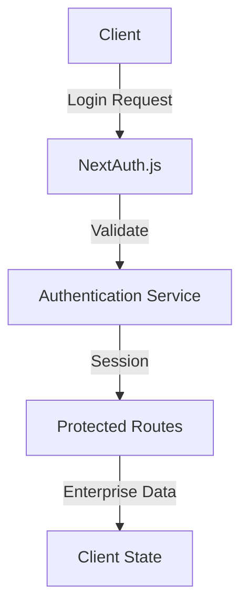
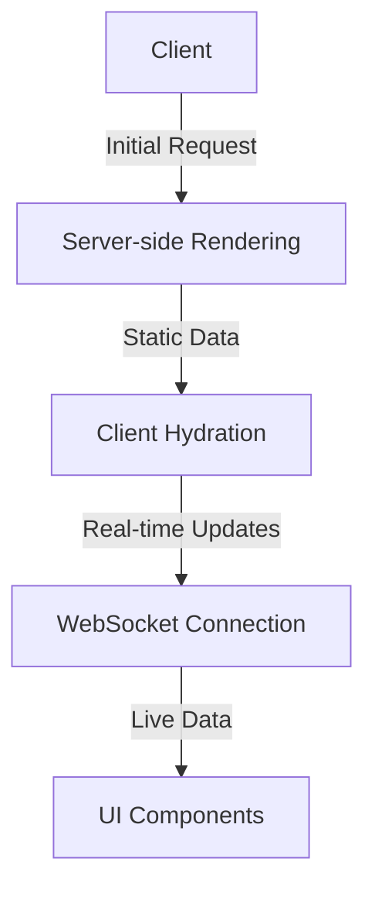
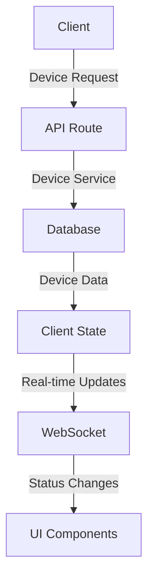
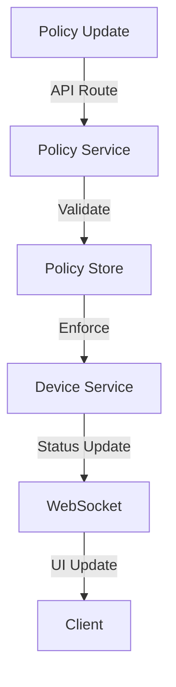

# Data Flow Models

## Authentication Flow

## Enterprise Dashboard Flow

## Device Management Flow

## Policy Enforcement Flow

## Real-time Data Flow

1. **WebSocket Events**

   - Device status updates
   - Policy violations
   - Tower status changes
   - Security alerts

2. **Data Synchronization**

   - Initial data load (SSR)
   - Real-time updates (WebSocket)
   - Client-side state management
   - Optimistic updates

3. **Caching Strategy**
   - Server-side caching
   - Client-side caching
   - Invalidation patterns
   - Cache updates

## Error Handling Flow

1. **Client-side Errors**

   - Validation errors
   - Network errors
   - State management errors

2. **Server-side Errors**

   - API errors
   - Database errors
   - Authentication errors

3. **Real-time Error Handling**
   - WebSocket disconnections
   - Reconnection strategies
   - Error recovery

## Data Transformation

1. **API Responses**

   - Data normalization
   - Type safety
   - Error handling

2. **Real-time Updates**
   - Event transformation
   - State updates
   - UI synchronization

## Performance Optimizations

1. **Data Fetching**

   - Server-side rendering
   - Incremental static regeneration
   - Client-side caching

2. **Real-time Updates**

   - Batch updates
   - Throttling
   - Debouncing

3. **State Management**
   - Optimistic updates
   - Background sync
   - Offline support
