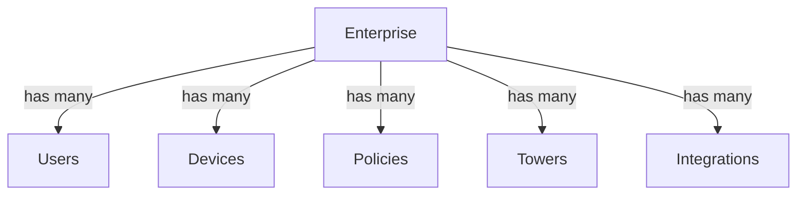
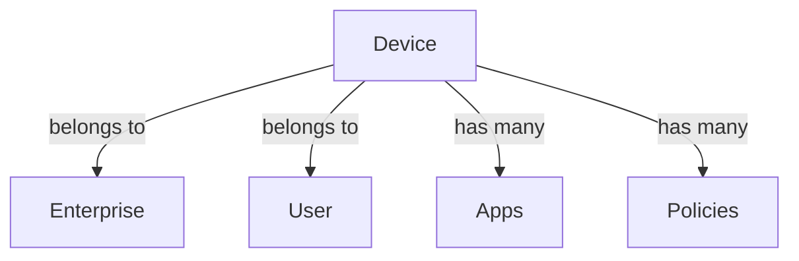
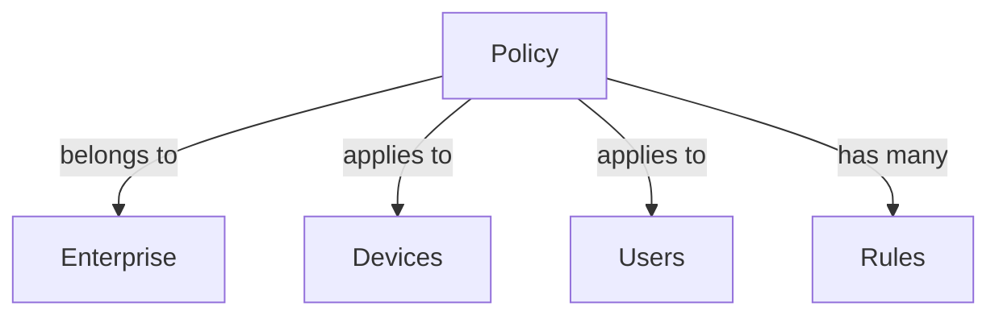

# Entity Models and Relationships

## Core Entities

### Enterprise

```typescript
interface Enterprise {
  id: string;
  name: string;
  description: string;
  status: EnterpriseStatus;
  createdAt: string;
  updatedAt: string;
  settings: EnterpriseSettings;
  metrics: EnterpriseMetrics;
  users: User[];
  devices: Device[];
  policies: Policy[];
  towers: Tower[];
  integrations: Integration[];
}
```

### User

```typescript
interface User {
  id: string;
  email: string;
  name: string;
  role: UserRole;
  status: UserStatus;
  enterpriseId: string;
  createdAt: string;
  updatedAt: string;
  lastLogin: string;
  preferences: UserPreferences;
}
```

### Device

```typescript
interface Device {
  id: string;
  name: string;
  type: DeviceType;
  status: DeviceStatus;
  enterpriseId: string;
  userId: string;
  createdAt: string;
  updatedAt: string;
  lastSeen: string;
  metrics: DeviceMetrics;
  policies: Policy[];
  apps: App[];
}
```

### Policy

```typescript
interface Policy {
  id: string;
  name: string;
  description: string;
  type: PolicyType;
  status: PolicyStatus;
  enterpriseId: string;
  createdAt: string;
  updatedAt: string;
  rules: PolicyRule[];
  devices: Device[];
  users: User[];
}
```

### Tower

```typescript
interface Tower {
  id: string;
  name: string;
  location: Location;
  status: TowerStatus;
  enterpriseId: string;
  createdAt: string;
  updatedAt: string;
  metrics: TowerMetrics;
  devices: Device[];
  integrations: Integration[];
}
```

### App

```typescript
interface App {
  id: string;
  name: string;
  version: string;
  type: AppType;
  status: AppStatus;
  deviceId: string;
  createdAt: string;
  updatedAt: string;
  metrics: AppMetrics;
  policies: Policy[];
}
```

### Integration

```typescript
interface Integration {
  id: string;
  name: string;
  type: IntegrationType;
  status: IntegrationStatus;
  enterpriseId: string;
  createdAt: string;
  updatedAt: string;
  config: IntegrationConfig;
  metrics: IntegrationMetrics;
}
```

## Entity Relationships

### Enterprise Relationships



### Device Relationships



### Policy Relationships



## Enums and Types

### Status Enums

```typescript
enum EnterpriseStatus {
  ACTIVE = "ACTIVE",
  SUSPENDED = "SUSPENDED",
  INACTIVE = "INACTIVE",
}

enum UserStatus {
  ACTIVE = "ACTIVE",
  INACTIVE = "INACTIVE",
  SUSPENDED = "SUSPENDED",
}

enum DeviceStatus {
  ONLINE = "ONLINE",
  OFFLINE = "OFFLINE",
  MAINTENANCE = "MAINTENANCE",
  ERROR = "ERROR",
}

enum PolicyStatus {
  ACTIVE = "ACTIVE",
  INACTIVE = "INACTIVE",
  DRAFT = "DRAFT",
}

enum TowerStatus {
  OPERATIONAL = "OPERATIONAL",
  MAINTENANCE = "MAINTENANCE",
  OFFLINE = "OFFLINE",
}

enum AppStatus {
  INSTALLED = "INSTALLED",
  UPDATING = "UPDATING",
  ERROR = "ERROR",
}

enum IntegrationStatus {
  ACTIVE = "ACTIVE",
  INACTIVE = "INACTIVE",
  ERROR = "ERROR",
}
```

### Type Enums

```typescript
enum UserRole {
  ADMIN = "ADMIN",
  MANAGER = "MANAGER",
  USER = "USER",
}

enum DeviceType {
  MOBILE = "MOBILE",
  TABLET = "TABLET",
  DESKTOP = "DESKTOP",
}

enum PolicyType {
  SECURITY = "SECURITY",
  USAGE = "USAGE",
  COMPLIANCE = "COMPLIANCE",
}

enum AppType {
  SYSTEM = "SYSTEM",
  USER = "USER",
  SERVICE = "SERVICE",
}

enum IntegrationType {
  API = "API",
  WEBHOOK = "WEBHOOK",
  DATABASE = "DATABASE",
}
```

## Metrics Models

### Enterprise Metrics

```typescript
interface EnterpriseMetrics {
  totalDevices: number;
  activeDevices: number;
  totalUsers: number;
  activeUsers: number;
  totalPolicies: number;
  activePolicies: number;
  totalTowers: number;
  operationalTowers: number;
  lastUpdated: string;
}
```

### Device Metrics

```typescript
interface DeviceMetrics {
  batteryLevel: number;
  signalStrength: number;
  dataUsage: number;
  lastSync: string;
  policyViolations: number;
  appUpdates: number;
  lastUpdated: string;
}
```

### Tower Metrics

```typescript
interface TowerMetrics {
  signalStrength: number;
  connectedDevices: number;
  dataThroughput: number;
  uptime: number;
  lastMaintenance: string;
  lastUpdated: string;
}
```

### App Metrics

```typescript
interface AppMetrics {
  version: string;
  size: number;
  lastUpdate: string;
  usage: number;
  crashes: number;
  lastUpdated: string;
}
```

### Integration Metrics

```typescript
interface IntegrationMetrics {
  status: string;
  lastSync: string;
  errorCount: number;
  successRate: number;
  latency: number;
  lastUpdated: string;
}
```

## Configuration Models

### Enterprise Settings

```typescript
interface EnterpriseSettings {
  theme: string;
  notifications: NotificationSettings;
  security: SecuritySettings;
  integrations: IntegrationSettings;
}
```

### User Preferences

```typescript
interface UserPreferences {
  theme: string;
  notifications: NotificationSettings;
  language: string;
  timezone: string;
}
```

### Integration Config

```typescript
interface IntegrationConfig {
  endpoint: string;
  credentials: Credentials;
  options: IntegrationOptions;
  webhooks: WebhookConfig[];
}
```

## Location Model

```typescript
interface Location {
  latitude: number;
  longitude: number;
  address: string;
  city: string;
  state: string;
  country: string;
  postalCode: string;
}
```
